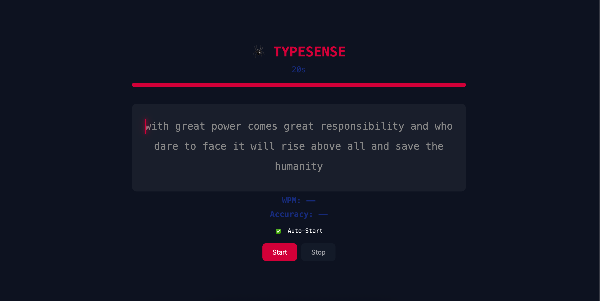

<div align="center">
   
</div>

<h3 align="center">
  ⌨️ Typesense – Typing Speed Test with WPM & Accuracy
  
</h3>

<p align="center">
  <a href="https://github.com/your-username/typesense">
    
  </a>
</p>

<p align="center">
  <a href="https://github.com/your-username/typesense">
    
  </a>
</p>

---

## ✨ About  

**Typesense** is a **typing speed test app** built with **HTML, CSS, and JavaScript**.  
It calculates **Words Per Minute (WPM)** and **accuracy** in real time while keeping a **minimal, distraction-free design**.  

---

## 🛠️ Tech Stack  

- **HTML5** – Structure  
- **CSS3** – Styling & Layout  
- **JavaScript (ES6)** – Typing logic & calculations  

---

## ⚡ Features  

- ✅ Real-time **WPM calculation**  
- ✅ Instant **accuracy tracking**  
- ✅ Clean and simple UI for focused typing  
- ✅ Restart test with one click  
- ✅ Fully responsive design  

---

## 📸 Screenshots  

<p align="center">
  
</p>

---

## ⚙️ Installation & Setup  

```bash
# Clone the repository
git clone https://github.com/your-username/typesense.git
cd typesense
```

### ▶️ Run Locally  

Just open the **`index.html`** file in your browser. 🎉  

---

## 🔮 Future Enhancements  

- 📊 Typing history & progress tracking  
- 🌐 Multiplayer typing race  
- 🎵 Sound & theme customization  

---

## 📜 License  

This project is licensed under the **MIT License**.  

---

<div align="center">
   <b>⌨️ Typesense – Practice typing. Improve speed. Stay accurate.</b>
</div>
